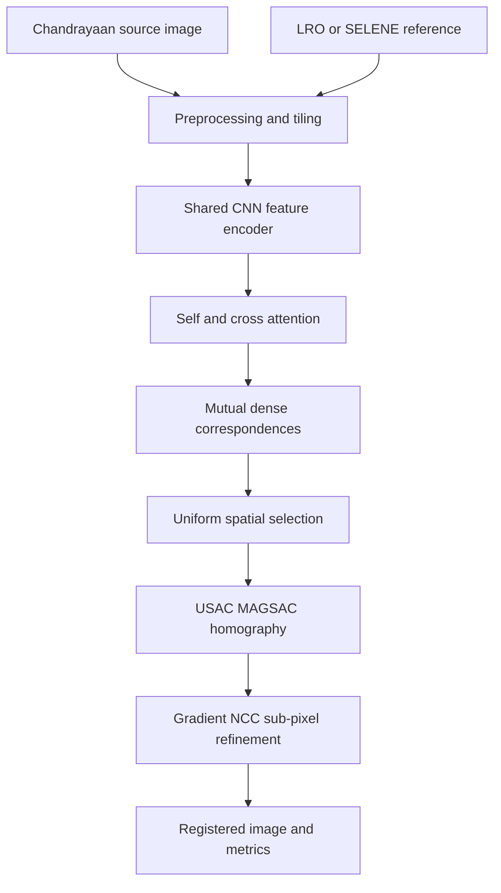

# LunarReg — SIH 2026 Lunar Image Registration

LunarReg is our Smart India Hackathon 2026 solution for finding accurate, spatially distributed correspondences between Chandrayaan-2 optical images and lunar reference imagery such as LRO NAC and SELENE.

The system is designed for the real difficulties of lunar imaging:

- large illumination changes caused by different Sun azimuth and elevation;
- viewpoint and perspective differences;
- large scale and resolution differences between sensors;
- weak texture, repeated craters and deep shadows;
- cross-sensor appearance differences among OHRC, TMC-2, IIRS, LRO and SELENE;
- the need for reliable matches over the complete image instead of one small region.

Our solution combines a trainable detector-free matcher with robust geometry and sub-pixel local refinement. A working SIFT + MAGSAC baseline is already included for the website demonstration. The learned registration model must be trained and independently validated before competition-level accuracy is claimed.

---

## 1. Problem statement in simple words

We receive two images of approximately the same lunar area:

- **Fixed/reference image:** the coordinate system we want to preserve.
- **Moving/source image:** the image that must be geometrically transformed.

The software must:

1. identify the same lunar locations in both images;
2. reject incorrect crater or shadow matches;
3. estimate the geometric transformation;
4. warp the moving image into the reference coordinate system;
5. refine the correspondence positions to fractional-pixel precision;
6. return match coordinates, registered imagery and objective metrics;
7. maintain a uniform match distribution across the scene.

The final output is not merely a visually blended picture. It contains the transformation matrix, accepted correspondences, confidence values, inlier mask and evaluation measurements.

---

## 2. Proposed SIH solution



The system is hybrid because no single method solves the full problem reliably:

- the neural matcher learns cross-sensor visual relationships;
- MAGSAC enforces geometric consistency;
- grid selection prevents all matches from concentrating around one crater;
- gradient NCC provides local fractional-pixel refinement;
- the classical SIFT route remains available as a fallback.

---

## 3. Main innovations and USP

### 3.1 Physics-aware Perlin illumination augmentation

Fractal Perlin fields simulate broad, spatially smooth illumination variation without changing the geometric correspondence labels. This is more realistic for changing lunar illumination than independent random pixel noise.

### 3.2 Detector-free matching

Traditional keypoint detectors may fail when shadows or sensor response change. Our model treats the images as feature grids and learns direct token-to-token correspondence.

### 3.3 Neural matching plus mathematical verification

The network proposes matches, but it is not blindly trusted. Mutual matching, spatial balancing and MAGSAC verify the correspondences before a transformation is accepted.

### 3.4 Uniform correspondence coverage

An 8×8 spatial grid limits the number of matches selected from each cell. This improves transformation stability and directly addresses the requirement for uniformly distributed matches.

### 3.5 Sub-pixel refinement

Coarse neural coordinates are refined with gradient-based normalized cross-correlation and parabolic peak fitting. This produces fractional coordinates rather than integer-only locations.

### 3.6 Honest confidence and failure handling

The system reports inlier count, inlier ratio, spatial coverage and reprojection error. It can reject pairs with insufficient overlap instead of presenting a false successful result.

---

## 4. Complete system architecture

| Stage | Method | Purpose |
|---|---|---|
| Input validation | Format, dimensions, dynamic range | Reject unreadable or empty products |
| Preprocessing | Grayscale, percentile stretch/CLAHE, normalization | Reduce radiometric differences |
| Tiling | 512×512 tiles with overlap | Make large orbital products trainable |
| Synthetic geometry | Random projective homography | Provide exact correspondence labels |
| Illumination augmentation | Gamma, directional light, Perlin, blur, noise | Model lunar appearance variation |
| Feature extraction | Shared four-stage CNN | Produce sensor-tolerant descriptors |
| Context exchange | Self-attention and cross-attention | Compare global structures between images |
| Matching | Dual-softmax and mutual nearest neighbour | Generate confident correspondences |
| Spatial control | 8×8 grid, confidence-ranked selection | Maintain uniform match distribution |
| Robust geometry | USAC_MAGSAC homography | Reject outliers and estimate alignment |
| Local refinement | Gradient NCC + quadratic fitting | Refine to fractional-pixel positions |
| Evaluation | RMSE, median/max error, inliers, ratio, coverage | Quantify registration quality |

---

## 5. Preprocessing pipeline

### 5.1 Product preparation

Keep the original PDS/GeoTIFF products and metadata unchanged in an archival directory. Create analysis-ready images separately.

Recommended steps:

1. read radiometrically corrected products when available;
2. preserve coordinate reference and acquisition metadata;
3. remove invalid borders and label areas;
4. convert to a consistent grayscale floating range ([0,1]);
5. apply robust percentile normalization or CLAHE;
6. resample only when required and record the scale factor;
7. split large products into overlapping 512×512 tiles;
8. discard blank or extremely low-variance tiles;
9. associate every tile with the parent product and lunar footprint.

### 5.2 Normalization

For image intensity (I), robust min-max normalization can be written as:

$$
I_n(x,y)=\operatorname{clip}\left(\frac{I(x,y)-p_2}{p_{98}-p_2+\epsilon},0,1\right)
$$

where (p_2) and (p_{98}) are the 2nd and 98th intensity percentiles. This is less sensitive to extreme shadows and saturated pixels than raw min-max scaling.

### 5.3 Geographic data split

The train, validation and test sets must be separated by lunar geography or parent mosaic. Tiles from the same crater or source mosaic must not occur in multiple splits.

A recommended split is:

- 70% geographic regions for training;
- 15% separate regions for validation;
- 15% completely unseen regions for final testing.

A random tile split is not acceptable because adjacent tiles can contain almost identical terrain.

---

## 6. Actual model architecture

The training ZIP implements `LunarDenseMatcher`, a detector-free dense coarse matcher.

### 6.1 Shared feature encoder

Both images pass through the same CNN weights. The encoder contains four `ConvNormAct` stages with channel widths:

```text
1 → 32 → 48 → 72 → 128
```

Each stage contains:

```text
3×3 convolution with stride 2
GroupNorm
GELU
3×3 convolution
GroupNorm
GELU
```

Four stride-2 stages produce an overall stride of 16. A 512×512 input therefore becomes a 32×32 feature grid containing 1024 tokens.

GroupNorm is used instead of BatchNorm because effective training batches may be small on high-resolution images.

### 6.2 Two-dimensional positional encoding

The flattened feature tokens receive sine/cosine position encodings for both horizontal and vertical coordinates:

$$
PE(x,y)=\left[\sin(x\omega),\cos(x\omega),\sin(y\omega),\cos(y\omega)\right]
$$

This allows attention layers to reason about both appearance and position.

### 6.3 Attention blocks

Each block performs:

1. self-attention within the source image;
2. self-attention within the reference image;
3. source-to-reference cross-attention;
4. reference-to-source cross-attention;
5. independent feed-forward networks with residual connections.

The supplied main configurations use:

```text
Feature dimension: 128
Attention heads: 4
Attention blocks: 2
Dropout: 0.0
```

For one attention head:

$$
\operatorname{Attention}(Q,K,V)=\operatorname{softmax}\left(\frac{QK^T}{\sqrt{d_k}}\right)V
$$

Cross-attention lets a source token obtain context directly from possible reference locations.

### 6.4 Descriptor projection and similarity

The output tokens are linearly projected and L2 normalized:

$$
\hat f_i=\frac{Wf_i}{\|Wf_i\|_2},\qquad
\hat g_j=\frac{Wg_j}{\|Wg_j\|_2}
$$

The similarity logit between source token (i) and reference token (j) is:

$$
S_{ij}=\tau\hat f_i^T\hat g_j
$$

where (	au) is a learned positive scale constrained to a stable range.

### 6.5 Dual-softmax confidence

The matching probability is calculated in both directions:

$$
P_{ij}=\operatorname{softmax}_{j}(S_{ij})\cdot
\operatorname{softmax}_{i}(S_{ij})
$$

A match is retained only when:

- it is the best source-to-reference choice;
- it is also the best reference-to-source choice;
- its confidence exceeds the selected threshold.

This mutual-nearest check removes many ambiguous crater matches.

---

## 7. Geometric mathematics

### 7.1 Homography model

For corresponding pixel coordinates (mathbf p=(x,y,1)^T) and (mathbf p'=(x',y',1)^T):

$$
\mathbf p'\sim H\mathbf p
$$

where:

$$
H=
\begin{bmatrix}
h_{11}&h_{12}&h_{13}\\
h_{21}&h_{22}&h_{23}\\
h_{31}&h_{32}&h_{33}
\end{bmatrix}
$$

The Euclidean projection is:

$$
x'=\frac{h_{11}x+h_{12}y+h_{13}}{h_{31}x+h_{32}y+h_{33}},\qquad
y'=\frac{h_{21}x+h_{22}y+h_{23}}{h_{31}x+h_{32}y+h_{33}}
$$

A homography has eight independent degrees of freedom because it is defined up to scale. At least four non-collinear correspondence pairs are required, but a reliable solution needs many distributed matches.

### 7.2 Robust MAGSAC estimation

Incorrect network/keypoint matches are outliers. USAC_MAGSAC repeatedly generates transformation hypotheses, evaluates geometric residuals and estimates the model using robust noise-scale handling.

The reprojection error for match (i) is:

$$
e_i=\left\|\pi(H\mathbf p_i)-\mathbf p'_i\right\|_2
$$

where (pi) converts homogeneous coordinates back to Euclidean coordinates. The supplied code uses a 2-pixel starting threshold, up to 10,000 iterations and confidence 0.999.

### 7.3 Uniform spatial selection

The source image is divided into an 8×8 grid. Candidate matches are sorted by confidence, and only the strongest limited number from each cell are retained.

If (C) is the set of occupied grid cells, coverage is:

$$
\text{Coverage}=\frac{|C|}{64}
$$

This prevents a large number of redundant points around one high-contrast crater from dominating the homography.

---

## 8. Training loss

The exact synthetic homography maps each source token centre to its correct reference position.

### 8.1 Coarse classification loss

If (t_i) is the reference-grid index containing the transformed source point, the forward negative log-likelihood is:

$$
\mathcal L_{c}^{s\rightarrow r}
=-\frac{1}{N_v}\sum_{i\in\mathcal V}\log
\operatorname{softmax}(S_{i,:})_{t_i}
$$

where (mathcal V) contains valid points that remain inside the image.

### 8.2 Continuous coordinate loss

The expected reference coordinate is calculated by soft-argmax:

$$
\hat{\mathbf q}_i=\sum_j
\operatorname{softmax}(S_{i,:})_j\mathbf g_j
$$

The fine loss uses Smooth L1 distance from the homography-derived target (mathbf q_i):

$$
\mathcal L_f^{s\rightarrow r}
=\frac{1}{N_v}\sum_{i\in\mathcal V}
\operatorname{SmoothL1}(\hat{\mathbf q}_i-\mathbf q_i)
$$

### 8.3 Bidirectional total loss

The same calculation is performed with (H^{-1}) in the reverse direction:

$$
\mathcal L_{dir}=\mathcal L_c+0.05\mathcal L_f
$$

$$
\mathcal L=\frac{1}{2}\left(
\mathcal L_{dir}^{s\rightarrow r}+
\mathcal L_{dir}^{r\rightarrow s}
\right)
$$

Each sample also has a weight. Exact synthetic labels receive full weight, while less certain pseudo-labelled real pairs receive a lower weight.

---

## 9. Perlin-noise illumination model

Perlin noise is used to improve illumination robustness—not as a matching algorithm and not as geometric truth.

### 9.1 Smooth interpolation

The quintic fade function is:

$$
f(t)=6t^5-15t^4+10t^3
$$

Random unit gradients are placed at grid corners. Their dot products with local offset vectors are interpolated using (f(t)), producing smooth coherent variation.

### 9.2 Fractal Perlin field

The code combines frequencies 2, 4 and 8 with persistence 0.5:

$$
N(x,y)=\frac{\sum_{k=0}^{K-1}p^kN_{2^{k+1}}(x,y)}
{\sum_{k=0}^{K-1}p^k},\qquad p=0.5
$$

### 9.3 Illumination augmentation

The augmented image is:

$$
I'(x,y)=\operatorname{clip}\left(
I(x,y)[1+\alpha N(x,y)]+\beta N(x,y),0,1
\right)
$$

with multiplicative strength (alpha\in[0.05,0.25]) and additive strength (eta\in[0.01,0.08]). It is applied with 85% probability along with gamma, contrast, directional lighting, blur and sensor noise.

Because the noise changes only appearance, the original homography labels remain valid.

---

## 10. Sub-pixel refinement

The coarse model operates at stride 16, so its matches require local refinement.

### 10.1 Gradient patches

Sobel derivatives generate gradient magnitude images:

$$
G=\sqrt{G_x^2+G_y^2}
$$

Gradients are less sensitive than raw intensity to global brightness offsets.

### 10.2 Normalized cross-correlation

For source patch (A) and reference patch (B):

$$
NCC(A,B)=
\frac{\sum(A-\bar A)(B-\bar B)}
{\sqrt{\sum(A-\bar A)^2\sum(B-\bar B)^2}+\epsilon}
$$

The implementation searches a ±5 pixel neighbourhood using 15×15 patches.

### 10.3 Fractional peak fitting

If the best discrete score is (s_0), with adjacent scores (s_{-1}) and (s_{+1}), the parabolic offset is:

$$
\delta=\frac{1}{2}\frac{s_{-1}-s_{+1}}{s_{-1}-2s_0+s_{+1}}
$$

(delta) is clipped to ([-0.5,0.5]) and calculated independently for (x) and (y). This produces fractional-pixel coordinates.

---

## 11. Evaluation metrics

All important metrics must be reported per sensor pair and per depth of difficulty, not only as one global average.

### Reprojection RMSE

$$
RMSE=\sqrt{\frac{1}{N}\sum_{i=1}^{N}e_i^2}
$$

### Median and maximum error

$$
e_{median}=\operatorname{median}(e_1,\ldots,e_N),\qquad
e_{max}=\max_i e_i
$$

Median error is robust to a few extreme points; maximum error reveals worst-case failures.

### Inlier ratio

$$
\text{Inlier Ratio}=\frac{N_{inlier}}{N_{candidate}}
$$

### PCK at threshold (t)

$$
PCK@t=\frac{1}{N}\sum_{i=1}^{N}\mathbf 1[e_i<t]
$$

Recommended reporting includes PCK@1, PCK@3 and PCK@5.

### Spatial coverage

Coverage is the occupied fraction of the 8×8 image grid. A low-RMSE solution with low coverage should not be accepted as a uniformly registered result.

### Runtime and failure rate

Record processing time, peak memory, percentage of rejected image pairs and reasons for rejection.

---

## 12. Datasets and folder structure

Recommended raw-data layout inside the training kit:

```text
data/raw/ohrc/
data/raw/tmc2/
data/raw/iirs/
data/raw/lro/
data/raw/selene/
```

The complete website package contains:

| File | Purpose |
|---|---|
| `downloads/LunarReg-Training-Kit-v1.zip` | PyTorch registration training and inference code |
| `downloads/training_tiles.zip` | 248 supplied labelled LRO NAC crater tiles |
| `downloads/lunar_crater_detector.zip` | Supplied YOLOv8n detector weights and prediction script |
| `downloads/CH3_region_69S_32E_dataset.zip` | Supplied Chandrayaan/LRO regional images and references |
| `docs/LunarReg_Model_Training_Handoff.pdf` | Detailed mathematical and training handoff |

Important: the crater-training tiles train crater detection, not image registration. Registration requires overlapping source/reference pairs or synthetic transformations with known homographies.

---

## 13. How to train the registration model

### 13.1 Extract and install

```bash
unzip LunarReg-Training-Kit-v1.zip
cd LunarReg-Training-Kit
python -m venv .venv
source .venv/bin/activate
python -m pip install --upgrade pip
pip install -r requirements.txt
python scripts/check_environment.py
```

Windows PowerShell activation:

```powershell
.venv\Scripts\Activate.ps1
```

CUDA verification:

```bash
python -c "import torch; print(torch.cuda.is_available()); print(torch.cuda.get_device_name(0) if torch.cuda.is_available() else 'CPU')"
```

### 13.2 Create training tiles

```bash
python scripts/prepare_tiles.py \
  --input data/raw/ohrc \
  --output data/tiles/ohrc \
  --size 512 --overlap 64 --min-std 0.025

python scripts/prepare_tiles.py \
  --input data/raw/lro \
  --output data/tiles/lro \
  --size 512 --overlap 64 --min-std 0.025
```

### 13.3 Run the mandatory smoke test

```bash
python scripts/make_demo_data.py
python train.py --config configs/smoke.yaml

python infer.py \
  --checkpoint runs/smoke/best.pt \
  --source data/demo/source.png \
  --reference data/demo/reference.png \
  --output runs/demo_inference
```

The smoke model only verifies installation and code flow. It is not a competition model.

### 13.4 Start the main GPU run

RTX 5090:

```bash
python train.py --config configs/train_5090.yaml
```

RTX PRO 5000:

```bash
python train.py --config configs/train_pro5000.yaml
```

Monitor:

```bash
tensorboard --logdir runs --bind_all
```

Resume safely:

```bash
python train.py \
  --config configs/train_5090.yaml \
  --resume runs/lunar_5090/last.pt
```

### 13.5 Generate real cross-sensor pseudo-labels

Create `data/manifests/candidates.csv`:

```csv
pair_id,source_path,reference_path,split
pair_0001,data/tiles/ohrc/ohrc_0001.png,data/tiles/lro/lro_0001.png,train
pair_0002,data/tiles/ohrc/ohrc_0002.png,data/tiles/lro/lro_0002.png,val
```

Then run:

```bash
python scripts/pseudo_label_loftr.py \
  --manifest data/manifests/candidates.csv \
  --output data/manifests/pseudo_pairs.csv \
  --preview-dir data/pseudo_previews
```

Inspect every preview. Reject incorrect, concentrated or geometrically distorted pairs before training.

### 13.6 Recommended training curriculum

1. Complete environment check and smoke run.
2. Overfit a controlled 100-pair synthetic subset.
3. Train OHRC synthetic transformations for 10–15 epochs.
4. Train LRO synthetic transformations for 10–15 epochs.
5. Generate and manually verify OHRC–LRO pseudo-pairs.
6. Fine-tune with approximately 70% synthetic and 30% accepted real pairs.
7. Tune thresholds only on geographically separate validation regions.
8. Add TMC-2 after OHRC–LRO results stabilise.
9. Add IIRS last because its spectral appearance differs substantially.
10. Freeze all settings before final independent evaluation.

### 13.7 Training outputs

```text
runs/<experiment>/
├── best.pt
├── last.pt
├── config.yaml
├── history.csv
└── tensorboard/
```

Inference produces:

```text
registered.png
matches.csv
matches_preview.png
metrics.json
homography.json
```

---

## 14. Model acceptance criteria

Do not call the trained model successful until:

- it can deliberately overfit a small controlled subset;
- held-out synthetic PCK@3 exceeds 90%;
- validation loss does not diverge from training loss;
- real pairs retain at least 30 MAGSAC inliers;
- accepted correspondences cover multiple image-grid cells;
- median independent reprojection error is below one pixel after refinement;
- results remain stable under illumination and scale changes;
- no parent mosaic or lunar region crosses the train/test boundary;
- all claimed sub-pixel results use verified control points or trustworthy georeferencing.

Training loss alone is not evidence of sub-pixel accuracy.

---

## 15. Current website and model status

### Working now

- responsive SIH demonstration interface;
- local browser translation baseline;
- server-side SIFT descriptors and Lowe-ratio matching;
- USAC_MAGSAC homography estimation;
- real measured metrics and downloadable registered overlay;
- supplied YOLOv8n crater detector;
- sample LRO image pair;
- complete training kit and documentation.

### Requires training/data validation

- learned `LunarDenseMatcher` competition checkpoint;
- verified OHRC–LRO independent test benchmark;
- confirmed sub-pixel score on official evaluation data;
- sensor-specific threshold calibration;
- optional TMC-2/IIRS domain adaptation.

The website clearly shows the model status and does not display fabricated competition results.

---

## 16. Using a trained checkpoint in the application

1. Select `best.pt` using geographically independent validation.
2. Copy it to `inference-service/models/lunar_dense_matcher.pt`.
3. Add a cached PyTorch model loader in `inference-service/app.py`.
4. Preprocess both inputs exactly as during training.
5. Obtain mutual neural correspondences.
6. Apply uniform 8×8 grid selection.
7. estimate the homography with MAGSAC;
8. refine inliers using gradient NCC;
9. return the existing API schema so the frontend does not need redesign;
10. retain SIFT as a fallback when neural coverage or inlier count is insufficient.

Do not replace `crater_detector.pt`; that checkpoint performs crater detection, not registration.

---

## 17. SIH demonstration flow

For a clear judging demonstration:

1. explain fixed versus moving images;
2. load the included sample to prove the full website works;
3. show detected correspondences and spatial coverage;
4. run SIFT + MAGSAC registration;
5. explain the homography and rejected outliers;
6. show the registered overlay and measured errors;
7. demonstrate crater detection as an additional analysis module;
8. open the training resources and explain the neural matcher;
9. demonstrate how Perlin augmentation changes illumination but preserves geometry;
10. clearly separate current measured results from post-training targets.

Recommended one-line pitch:

> LunarReg learns where the same lunar feature exists across sensors, mathematically verifies those matches, and refines them to fractional-pixel coordinates while remaining robust to changing illumination.

---

## 18. Limitations and responsible claims

- One homography cannot fully model strong local relief displacement or severe parallax.
- The browser baseline estimates translation only.
- SIFT is a classical baseline, not the final learned matcher.
- The supplied crater detector was trained on a small LRO NAC dataset and may not transfer directly to Chandrayaan sensors.
- A random tile split can produce unrealistically high accuracy.
- Perlin noise approximates smooth illumination variation; it is not a physical ray-tracing model.
- Generic optical imagery cannot produce validated mineral composition or landing-safety certification.
- Official SIH evaluation data must remain untouched until final testing.

---

## 19. Repository structure

```text
LunarReg/
├── index.html
├── assets/
│   ├── app.js
│   └── site.css
├── samples/
├── docs/
│   └── LunarReg_Model_Training_Handoff.pdf
├── downloads/
│   ├── LunarReg-Training-Kit-v1.zip
│   ├── training_tiles.zip
│   ├── lunar_crater_detector.zip
│   └── CH3_region_69S_32E_dataset.zip
├── inference-service/
│   ├── app.py
│   ├── requirements.render.txt
│   └── models/crater_detector.pt
├── Dockerfile.render
├── Dockerfile
├── render.yaml
├── api/
├── vercel.json
└── README.md
```

---

## 20. Data credits

- Chandrayaan mission imagery: ISRO/ISSDC.
- LROC imagery: NASA/GSFC/Arizona State University.
- The supplied regional archive contains additional paper references and source notes.
- The supplied crater material identifies 248 LRO NAC tiles originating from Fairweather et al., Zenodo 6386198, under CC BY 4.0.

Always preserve the source metadata and verify the applicable terms before redistribution.

---

## 21. Final deployment on Render

Deployment is intentionally kept at the end because the scientific pipeline, model and evaluation are the main SIH project.

### GitHub preparation

Extract the project ZIP and copy the files inside the extracted project folder into the root of your GitHub repository. These must be visible at the repository root:

```text
render.yaml
Dockerfile
index.html
README.md
inference-service/
assets/
downloads/
```

### One-click Blueprint deployment

1. Push the complete project to the `main` branch.
2. Open the Render dashboard.
3. Select **New → Blueprint**.
4. Connect the LunarReg GitHub repository.
5. Confirm the `lunarreg` service detected from `render.yaml`.
6. Apply the Blueprint.
7. Wait for the first Docker build; PyTorch and Ultralytics make the initial build slower.
8. Open the generated `onrender.com` URL.
9. Test **Load included sample** and run registration.
10. Check `/api/health` if the interface cannot reach the backend.

If you are using an existing manually created Render Web Service, set its runtime to **Docker**, leave **Root Directory** empty, and use `./Dockerfile` as the Dockerfile path. The included root `Dockerfile` also allows Render's default Docker settings to work without a custom path.

The single Render service hosts:

- the website at `/`;
- status at `/api/model-status`;
- registration at `/api/register`;
- crater detection at `/api/detect-craters`;
- health check at `/api/health`.

The free plan is suitable for an initial demonstration, but PyTorch crater inference may need additional RAM. Registration training should be performed on a dedicated NVIDIA GPU machine or RunPod, not on the Render web service.
